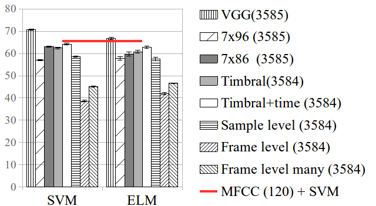

# elmarc
Repository containg experiments with Extreme Learning Machines And Reservoir Computing, ELMARC.

## Randomly weighted CNNs for (music) audio classification
The computer vision literature shows that randomly weighted neural networks perform reasonably as feature extractors. Following this idea, we study how non-trained (randomly weighted) convolutional neural networks perform as feature extractors for (music) audio classification tasks. We use features extracted from the embeddings of
deep architectures as input to a classifier – with the goal to compare classification accuracies when using different randomly weighted architectures. By following this methodology, we run a comprehensive evaluation of the current deep architectures for audio classification.

This study builds on top of prior works showing that the (classification) performance delivered by random CNN
features is correlated with the results of their end-to-end trained counterparts [40, 42]. We use this property to run a comprehensive evaluation of current deep architectures for (music) audio. Our method is as follows: first, we
extract a feature vector from the embeddings of a randomly weighted CNN; and then, we input these features
to a classifier – which can be an SVM or an ELM. Our goal is to compare the obtained classification accuracies
when using different CNN architectures. We consider three datasets for our study; the first one, is the fault-filtered GTZAN dataset for music genre classification (classification accuracy is the figure-of-merit expressed in the vertical axis of the following figures):

The second dataset is the Extended Ballroom (with rhythm/tempo music classes):

In previous graphic one can observe that (musical) priors embedded in the structure of the model can facilitate capturing useful (temporal) cues for classifying rhythm/tempo classes – see the accuracy performance of the Temporal architecture (89.82%), which is very close to the state-of-the-art (94.9%).

And the last dataset is the Urban Sounds 8k, a dataset of natural (non-music) sounds:

The results we obtain are far from random, since: (i) randomly weighted CNNs are (in some cases) close to match the accuracies obtained by trained CNNs; and (ii) these are able to outperform MFCCs. 
Further, one can observe that for waveform front-ends: sample-level >> frame-level many-shapes > frame-level – as noted in the (trained) literature [26, 51, 52]. And finally, for spectrogram front-ends: 7x96<7x86 – as shown in prior (trained) works [30, 35]. 

See more details in the paper.

## MIT License
Copyright (c) 2017 - Music Technology Group, Universitat Pompeu Fabra. Code developed by Jordi Pons.
Permission is hereby granted, free of charge, to any person obtaining a copy of this software and associated documentation files (the "Software"), to deal in the Software without restriction, including without limitation the rights to use, copy, modify, merge, publish, distribute, sublicense, and/or sell copies of the Software, and to permit persons to whom the Software is furnished to do so, subject to the following conditions:

The above copyright notice and this permission notice shall be included in all copies or substantial portions of the Software.

THE SOFTWARE IS PROVIDED "AS IS", WITHOUT WARRANTY OF ANY KIND, EXPRESS OR IMPLIED, INCLUDING BUT NOT LIMITED TO THE WARRANTIES OF MERCHANTABILITY, FITNESS FOR A PARTICULAR PURPOSE AND NONINFRINGEMENT. IN NO EVENT SHALL THE AUTHORS OR COPYRIGHT HOLDERS BE LIABLE FOR ANY CLAIM, DAMAGES OR OTHER LIABILITY, WHETHER IN AN ACTION OF CONTRACT, TORT OR OTHERWISE, ARISING FROM, OUT OF OR IN CONNECTION WITH THE SOFTWARE OR THE USE OR OTHER DEALINGS IN THE SOFTWARE.
